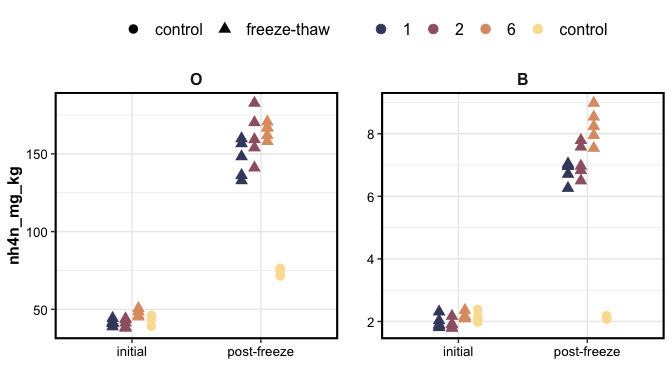
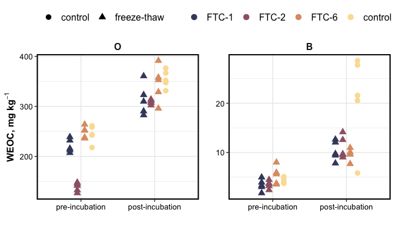
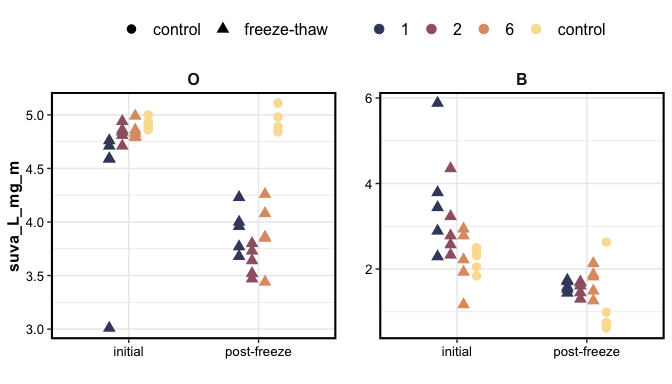
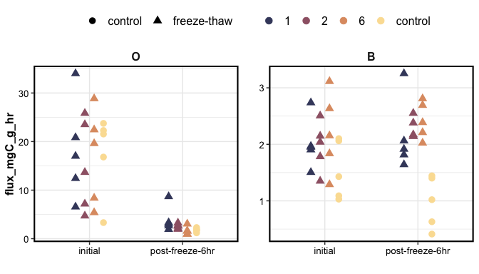
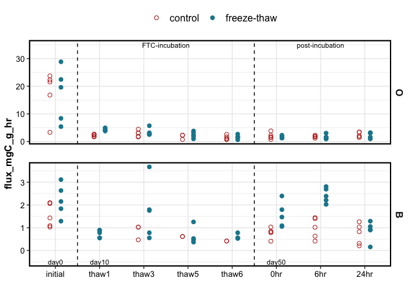

DBDF-FTC incubations
================

## Experiment

O and B horizon soils were collected from the Dwight B. Demerritt
Forest. Sieved (6 mm/2 mm) and homogenized.  
The soil was weighed into Mason jars and subjected to one of four
treatments (experimental replication n = 5):

1.  FTC-1: frozen continuously with one 24-hour thaw period
2.  FTC-2: frozen continuously with two 24-hour thaw periods
3.  FTC-6: frozen continuously with six 24-hour thaw periods
4.  control: continuously kept at +5 C

Incubations lasted 6 weeks (42 days) total.

Frozen conditions were -10 C, thaw conditions were +5 C

Subsamples were collected from the soils before and after the
incubation, for chemistry analysis.

Respiration (CO2 flux) was measured on all samples before and after the
incubation, and on FTC-6 soils during a few thaw periods. The jars were
sealed for 60 minutes, and 10-mL headspace samples were collected with a
syringe at 0, 20, 40, 60 minute intervals.

## Results

<!-- -->

    #> $gg_weoc

<!-- -->

    #> 
    #> $gg_suva

<!-- -->

<!-- -->

Temporal changes in respiration for FTC-6 and control soils, measured
during the thaw periods

<!-- -->

------------------------------------------------------------------------

Session Info

Date run: `r`Sys.Date()\`

    #> R version 4.0.2 (2020-06-22)
    #> Platform: x86_64-apple-darwin17.0 (64-bit)
    #> Running under: macOS Catalina 10.15.7
    #> 
    #> Matrix products: default
    #> BLAS:   /System/Library/Frameworks/Accelerate.framework/Versions/A/Frameworks/vecLib.framework/Versions/A/libBLAS.dylib
    #> LAPACK: /Library/Frameworks/R.framework/Versions/4.0/Resources/lib/libRlapack.dylib
    #> 
    #> locale:
    #> [1] en_US.UTF-8/en_US.UTF-8/en_US.UTF-8/C/en_US.UTF-8/en_US.UTF-8
    #> 
    #> attached base packages:
    #> [1] stats     graphics  grDevices utils     datasets  methods  
    #> [7] base     
    #> 
    #> other attached packages:
    #>  [1] soilpalettes_0.1.0 PNWColors_0.1.0    patchwork_1.1.1   
    #>  [4] forcats_0.5.1      stringr_1.4.0      dplyr_1.0.4       
    #>  [7] purrr_0.3.4        readr_1.4.0        tidyr_1.1.2       
    #> [10] tibble_3.0.6       ggplot2_3.3.3      tidyverse_1.3.0   
    #> [13] drake_7.13.1      
    #> 
    #> loaded via a namespace (and not attached):
    #>  [1] Rcpp_1.0.6         lubridate_1.7.9.2  txtq_0.2.3        
    #>  [4] prettyunits_1.1.1  utf8_1.1.4         assertthat_0.2.1  
    #>  [7] digest_0.6.27      R6_2.5.0           cellranger_1.1.0  
    #> [10] backports_1.2.1    reprex_1.0.0       evaluate_0.14     
    #> [13] highr_0.8          httr_1.4.2         pillar_1.4.7      
    #> [16] rlang_0.4.10       progress_1.2.2     readxl_1.3.1      
    #> [19] rstudioapi_0.13    rmarkdown_2.6.6    labeling_0.4.2    
    #> [22] igraph_1.2.6       munsell_0.5.0      broom_0.7.4       
    #> [25] compiler_4.0.2     modelr_0.1.8       xfun_0.20         
    #> [28] pkgconfig_2.0.3    htmltools_0.5.1.1  tidyselect_1.1.0  
    #> [31] fansi_0.4.2        crayon_1.4.0       dbplyr_2.0.0      
    #> [34] withr_2.4.1        grid_4.0.2         jsonlite_1.7.2    
    #> [37] gtable_0.3.0       lifecycle_0.2.0    DBI_1.1.1         
    #> [40] magrittr_2.0.1     storr_1.2.5        scales_1.1.1      
    #> [43] cli_2.2.0          stringi_1.5.3      farver_2.0.3      
    #> [46] fs_1.5.0           xml2_1.3.2         ellipsis_0.3.1    
    #> [49] filelock_1.0.2     generics_0.1.0     vctrs_0.3.6       
    #> [52] RColorBrewer_1.1-2 tools_4.0.2        glue_1.4.2        
    #> [55] hms_1.0.0          parallel_4.0.2     yaml_2.2.1        
    #> [58] colorspace_2.0-0   base64url_1.4      rvest_0.3.6       
    #> [61] knitr_1.31         haven_2.3.1

