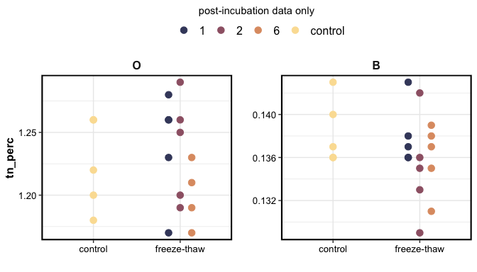

DBDF-FTC incubations
================

## “Repeated freeze-thaw cycles increase extractable, but not total, carbon and nitrogen in a Maine coniferous soil”

### Experiment

O and B horizon soils were collected from the Dwight B. Demerritt
Forest. Sieved (6 mm/2 mm) and homogenized.  
The soil was weighed into Mason jars and subjected to one of four
treatments (experimental replication n = 5):

1.  FTC-1: frozen continuously with one 24-hour thaw period
2.  FTC-2: frozen continuously with two 24-hour thaw periods
3.  FTC-6: frozen continuously with six 24-hour thaw periods
4.  control: continuously kept at +5 C

Incubations lasted 6 weeks (42 days) total.

Frozen conditions were -10 C, thaw conditions were +5 C

Subsamples were collected from the soils before and after the
incubation, for chemistry analysis.

Respiration (CO2 flux) was measured on all samples before and after the
incubation, and on FTC-6 soils during a few thaw periods. The jars were
sealed for 60 minutes, and 10-mL headspace samples were collected with a
syringe at 0, 20, 40, 60 minute intervals.

### Results

**Total C, total N**

    #> $gg_tc

<!-- -->

    #> 
    #> $gg_tn

<!-- -->

**Extractable NH4-N**

<!-- -->

**Water extractable organic C**

    #> $gg_weoc

<!-- -->

    #> 
    #> $gg_suva

<!-- -->

**Respiration**

<!-- -->

Temporal changes in respiration for FTC-6 and control soils, measured
during the thaw periods

<!-- -->

------------------------------------------------------------------------

Session Info

Date run: `r`Sys.Date()\`

    #> R version 4.0.2 (2020-06-22)
    #> Platform: x86_64-apple-darwin17.0 (64-bit)
    #> Running under: macOS Catalina 10.15.7
    #> 
    #> Matrix products: default
    #> BLAS:   /System/Library/Frameworks/Accelerate.framework/Versions/A/Frameworks/vecLib.framework/Versions/A/libBLAS.dylib
    #> LAPACK: /Library/Frameworks/R.framework/Versions/4.0/Resources/lib/libRlapack.dylib
    #> 
    #> locale:
    #> [1] en_US.UTF-8/en_US.UTF-8/en_US.UTF-8/C/en_US.UTF-8/en_US.UTF-8
    #> 
    #> attached base packages:
    #> [1] stats     graphics  grDevices utils     datasets  methods   base     
    #> 
    #> other attached packages:
    #>  [1] agricolae_1.3-3    soilpalettes_0.1.0 patchwork_1.1.1   
    #>  [4] PNWColors_0.1.0    forcats_0.5.1      stringr_1.4.0     
    #>  [7] dplyr_1.0.4        purrr_0.3.4        readr_1.4.0       
    #> [10] tidyr_1.1.2        tibble_3.0.6       ggplot2_3.3.3     
    #> [13] tidyverse_1.3.0    drake_7.13.1      
    #> 
    #> loaded via a namespace (and not attached):
    #>  [1] nlme_3.1-152      fs_1.5.0          lubridate_1.7.9.2
    #>  [4] filelock_1.0.2    progress_1.2.2    httr_1.4.2       
    #>  [7] tools_4.0.2       backports_1.2.1   R6_2.5.0         
    #> [10] AlgDesign_1.2.0   DBI_1.1.1         questionr_0.7.4  
    #> [13] colorspace_2.0-0  withr_2.4.1       tidyselect_1.1.0 
    #> [16] prettyunits_1.1.1 klaR_0.6-15       compiler_4.0.2   
    #> [19] cli_2.2.0         rvest_0.3.6       xml2_1.3.2       
    #> [22] labeling_0.4.2    scales_1.1.1      digest_0.6.27    
    #> [25] txtq_0.2.3        rmarkdown_2.6.6   pkgconfig_2.0.3  
    #> [28] htmltools_0.5.1.1 labelled_2.7.0    dbplyr_2.0.0     
    #> [31] fastmap_1.1.0     highr_0.8         rlang_0.4.10     
    #> [34] readxl_1.3.1      rstudioapi_0.13   shiny_1.6.0      
    #> [37] farver_2.0.3      generics_0.1.0    combinat_0.0-8   
    #> [40] jsonlite_1.7.2    magrittr_2.0.1    Rcpp_1.0.6       
    #> [43] munsell_0.5.0     fansi_0.4.2       lifecycle_0.2.0  
    #> [46] stringi_1.5.3     yaml_2.2.1        MASS_7.3-53      
    #> [49] storr_1.2.5       grid_4.0.2        parallel_4.0.2   
    #> [52] promises_1.1.1    crayon_1.4.0      miniUI_0.1.1.1   
    #> [55] lattice_0.20-41   haven_2.3.1       hms_1.0.0        
    #> [58] knitr_1.31        pillar_1.4.7      igraph_1.2.6     
    #> [61] base64url_1.4     reprex_1.0.0      glue_1.4.2       
    #> [64] evaluate_0.14     modelr_0.1.8      vctrs_0.3.6      
    #> [67] httpuv_1.5.5      cellranger_1.1.0  gtable_0.3.0     
    #> [70] assertthat_0.2.1  xfun_0.20         mime_0.9         
    #> [73] xtable_1.8-4      broom_0.7.4       later_1.1.0.1    
    #> [76] tinytex_0.29      cluster_2.1.0     ellipsis_0.3.1

