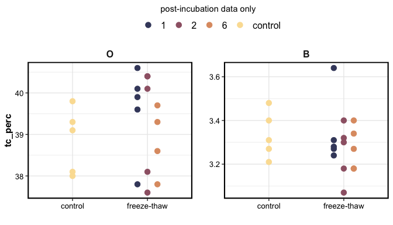

DBDF-FTC incubations
================

## “Repeated freeze-thaw cycles increase extractable, but not total, carbon and nitrogen in a Maine coniferous soil”

### Experiment

O and B horizon soils were collected from the Dwight B. Demerritt
Forest. Sieved (6 mm/2 mm) and homogenized.  
The soil was weighed into Mason jars and subjected to one of four
treatments (experimental replication n = 5):

1.  FTC-1: frozen continuously with one 24-hour thaw period
2.  FTC-2: frozen continuously with two 24-hour thaw periods
3.  FTC-6: frozen continuously with six 24-hour thaw periods
4.  control: continuously kept at +5 C

Incubations lasted 6 weeks (42 days) total.

Frozen conditions were -10 C, thaw conditions were +5 C

Subsamples were collected from the soils before and after the
incubation, for chemistry analysis.

Respiration (CO2 flux) was measured on all samples before and after the
incubation, and on FTC-6 soils during a few thaw periods. The jars were
sealed for 60 minutes, and 10-mL headspace samples were collected with a
syringe at 0, 20, 40, 60 minute intervals.

### Results

**Total C, total N**

    #> $gg_tc

<!-- -->

    #> 
    #> $gg_tn

<!-- -->

**Extractable NH4-N**

<!-- -->

**Water extractable organic C**

    #> $gg_weoc

<!-- -->

    #> 
    #> $gg_suva

<!-- -->

**Respiration**

<!-- -->

Temporal changes in respiration for FTC-6 and control soils, measured
during the thaw periods

<!-- -->

**Pre-treatment table**

| horizon | variable         | control       | FTC-1         | FTC-2         | FTC-6         |
|:--------|:-----------------|:--------------|:--------------|:--------------|:--------------|
| B       | flux\_mgC\_g\_hr | 1.54 ± 0.23   | 2.01 ± 0.2    | 1.97 ± 0.19   | 2.2 ± 0.31    |
| B       | nh4\_mg\_kg      | 2.14 ± 0.07   | 1.98 ± 0.09   | 1.92 ± 0.07   | 2.18 ± 0.05   |
| B       | suva\_L\_mg\_m   | 2.23 ± 0.12   | 3.66 ± 0.61   | 3.05 ± 0.36   | 2.21 ± 0.32   |
| B       | weoc\_mg\_kg     | 4.25 ± 0.25   | 3.39 ± 0.53   | 3.49 ± 0.34   | 5.36 ± 0.82   |
| O       | flux\_mgC\_g\_hr | 17.54 ± 3.74  | 18.16 ± 4.62  | 14.98 ± 4.24  | 16.93 ± 4.39  |
| O       | nh4\_mg\_kg      | 43.62 ± 1.63  | 41.47 ± 0.87  | 41.07 ± 1.22  | 47.67 ± 1.24  |
| O       | suva\_L\_mg\_m   | 4.91 ± 0.02   | 4.33 ± 0.33   | 4.83 ± 0.04   | 4.85 ± 0.04   |
| O       | weoc\_mg\_kg     | 244.69 ± 7.72 | 221.24 ± 6.05 | 138.65 ± 3.94 | 248.48 ± 5.13 |

------------------------------------------------------------------------

Session Info

Date run: `r`Sys.Date()\`

    #> R version 4.0.2 (2020-06-22)
    #> Platform: x86_64-apple-darwin17.0 (64-bit)
    #> Running under: macOS Catalina 10.15.7
    #> 
    #> Matrix products: default
    #> BLAS:   /System/Library/Frameworks/Accelerate.framework/Versions/A/Frameworks/vecLib.framework/Versions/A/libBLAS.dylib
    #> LAPACK: /Library/Frameworks/R.framework/Versions/4.0/Resources/lib/libRlapack.dylib
    #> 
    #> locale:
    #> [1] en_US.UTF-8/en_US.UTF-8/en_US.UTF-8/C/en_US.UTF-8/en_US.UTF-8
    #> 
    #> attached base packages:
    #> [1] stats     graphics  grDevices utils     datasets  methods  
    #> [7] base     
    #> 
    #> other attached packages:
    #>  [1] agricolae_1.3-3    soilpalettes_0.1.0 PNWColors_0.1.0   
    #>  [4] patchwork_1.1.1    forcats_0.5.1      stringr_1.4.0     
    #>  [7] dplyr_1.0.6        purrr_0.3.4        readr_1.4.0       
    #> [10] tidyr_1.1.3        tibble_3.1.2       ggplot2_3.3.3     
    #> [13] tidyverse_1.3.1    drake_7.13.1      
    #> 
    #> loaded via a namespace (and not attached):
    #>  [1] nlme_3.1-152      fs_1.5.0          lubridate_1.7.10 
    #>  [4] filelock_1.0.2    progress_1.2.2    httr_1.4.2       
    #>  [7] tools_4.0.2       backports_1.2.1   utf8_1.1.4       
    #> [10] R6_2.5.0          AlgDesign_1.2.0   DBI_1.1.1        
    #> [13] questionr_0.7.4   colorspace_2.0-0  withr_2.4.1      
    #> [16] tidyselect_1.1.0  prettyunits_1.1.1 klaR_0.6-15      
    #> [19] compiler_4.0.2    cli_2.5.0         rvest_1.0.0      
    #> [22] xml2_1.3.2        labeling_0.4.2    scales_1.1.1     
    #> [25] digest_0.6.27     txtq_0.2.3        rmarkdown_2.6.6  
    #> [28] pkgconfig_2.0.3   htmltools_0.5.1.1 labelled_2.7.0   
    #> [31] dbplyr_2.1.1      fastmap_1.1.0     highr_0.8        
    #> [34] rlang_0.4.10      readxl_1.3.1      rstudioapi_0.13  
    #> [37] shiny_1.6.0       farver_2.0.3      generics_0.1.0   
    #> [40] combinat_0.0-8    jsonlite_1.7.2    magrittr_2.0.1   
    #> [43] Rcpp_1.0.6        munsell_0.5.0     fansi_0.4.2      
    #> [46] lifecycle_1.0.0   stringi_1.5.3     yaml_2.2.1       
    #> [49] MASS_7.3-53       storr_1.2.5       grid_4.0.2       
    #> [52] parallel_4.0.2    promises_1.1.1    crayon_1.4.1     
    #> [55] miniUI_0.1.1.1    lattice_0.20-41   haven_2.3.1      
    #> [58] hms_1.0.0         knitr_1.31        pillar_1.6.1     
    #> [61] igraph_1.2.6      base64url_1.4     reprex_2.0.0     
    #> [64] glue_1.4.2        evaluate_0.14     modelr_0.1.8     
    #> [67] vctrs_0.3.8       httpuv_1.5.5      cellranger_1.1.0 
    #> [70] gtable_0.3.0      assertthat_0.2.1  xfun_0.20        
    #> [73] mime_0.9          xtable_1.8-4      broom_0.7.6      
    #> [76] later_1.1.0.1     tinytex_0.29      cluster_2.1.0    
    #> [79] ellipsis_0.3.2

